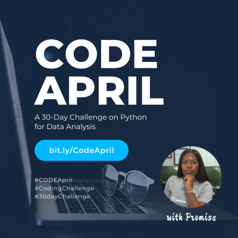

# CODE-APRIL 
*A 30-Day Python Coding Challenge for Beginners*



**CODE April** is a community-driven 30-day coding challenge designed to help individuals—especially beginners and career changers—build practical programming skills using Python. It promotes hands-on learning, consistency, and peer encouragement in a low-barrier, high-impact format. It allows individuals to enhance their coding skills, gain confidence, and celebrate achievements as they progress through the challenge over 30 days.

The challenge ran in April 2024 and attracted over **200 participants**, who received daily exercises, learning materials, and support via Telegram and YouTube. This repository hosts the full challenge materials and solutions.

---

## 📚 What Does It Entail?

- 📝 **Daily coding exercises** using Python fundamentals
- 🎥 **YouTube video solutions** with step-by-step walkthroughs
- 💬 **Community discussions** on Telegram and social media
- ✅ **Beginner-friendly Jupyter Notebooks** grouped by week

> 📌 Please note: CODE April is not a formal training course. It is a self-paced, challenge-based learning series with community support.

---

## 📦 Repo Structure

``` CODE-APRIL/
├── notebooks/ <- Jupyter Notebooks (Weeks 1–4)
│ ├── Week 1.ipynb
│ ├── Week 2.ipynb
│ ├── Week 3.ipynb
│ ├── Week 4.ipynb
│ ├── titanic.ipynb
│ ├── airline_dataset.ipynb
├── Submissions/ <- Participant submissions
├── Images/ <- Flyers and visuals
├── main_flyer_small.png
└── README.md
```


---

## ▶️ YouTube Video Walkthroughs

Each challenge has a corresponding YouTube video where I explain:
- The problem breakdown
- How to approach it as a beginner
- Python concepts used
- Key takeaways

📺 YouTube Channel: [@PromiseEkeh](https://www.youtube.com/@Promisekeh)  
🔗 Playlist: [CODE April – Python for Beginners](https://www.youtube.com/playlist?list=PLOAh0XkG_6et81NHSPvRCfdNbAO8Z9xtO)

---

## 💻 Platform

All communications and materials were distributed via:
- Telegram (daily prompts, community chat)
- YouTube (video tutorials)
- GitHub (code & solutions)

Participants were encouraged to share progress via:
- Telegram group
- WhatsApp (peer circles)
- Social media using hashtags below 👇

---

## 🔁 How It Worked

1. Participants signed up via [Google Form](https://bit.ly/CodeApril)
2. Gained access to the Telegram challenge group
3. Received a **daily challenge + learning resource** (text, doc, or video)
4. Shared their solutions as screenshots on the group or on social media
5. Engaged with others, asked questions, and celebrated milestones

---

## 🔖 Hashtags

Helped participants connect and share across platforms:

`#CODEApril` `#30DayChallenge` `#LearnPython` `#CodingChallenge`

---

## 📣 Impact

- ✅ 200+ participants
- 🌍 10+ countries represented
- 📊 Dozens of submissions shared
- 💬 Strong engagement and feedback

See `Submissions/` for examples from the community.

---

## 🧠 Meet the Creator

**Promise Ekeh**  
Founder, CODE April | Data Scientist & Educator  
[Youtube](https://www.youtube.com/@Promisekeh)  
[@Promisekeh on LinkedIn](https://www.linkedin.com/in/promisekeh/)

---

Let’s keep building, learning, and sharing 🚀  
Feel free to fork, star ⭐️, or share this challenge to support more learners!

 


## Feedbacks
## 💬 Testimonials

> **"CODE April came when I needed to grow my Data Analysis skills in Python and I am grateful I took advantage of it. The support I received from the community was overwhelming. Whenever I was stuck and shared my problem, I always received help in the community. Also seeing others complete their daily tasks challenged me to work hard and complete mine. The tasks were challenging and fun."**  
> — *@Prince_Omonigho*

---

> **"If I must say, @promisekeh knows just how to deliver knowledge in a well tailored and organized manner!  
> Time is a challenge recently, but if this April journey must be rated by me, it's a 5 ⭐️.  
> Thanks to all the tutors."**

---

> **"Thanks for making it an amazing and inspiring journey so far!  
> We started day 1 with baby steps and found it easy to advance on a daily basis.  
> Truly, we can do small things in a great way!  
> Always thoughtful and understanding at every point in time, knowing that people need to progress at their own pace.  
> Responsive in a timely manner and not leaving anyone behind.  
> Thank you for your time and kindness throughout the journey."**  
> — *@alabipaul9835*

---

> **"The Director, Promise Ekeh, was my motivation.  
> I stumbled on a YouTube video she made on Python and Data Science and was wowed by how excellently she simplifies programming.  
> When I saw CODE April on her timeline, I knew it was my chance to collaborate with someone I truly admire."**  
> — *@Joshua_I (Geomarine_Consult)*

---

> **"I have always been interested in Python programming for oil and gas applications because I studied geology.  
> I initially used it to analyze well logs but got distracted (urgent 2k, lol).  
> CODE April rekindled my passion and I’m ready to go back."**  
> — *@Richard_Akinwande*

---

> **"I’m part of the just concluded CODE April challenge and I must say it provided a platform for growth, correction, perfection, and collaboration.  
> The daily tasks were intense and they shaped me into a better data scientist.  
> A big hand to the Director and all facilitators. I’m already looking forward to the next challenge!"**  
> — *@Joshua_Nedion*

---

> **"I learned to never give up. At some point, the challenge became complex and I felt like quitting.  
> But seeing others post their assignments motivated me to catch up—finishing 7 days in 3 days!  
> I believed I could do it, and I did."**  
> — *@Stephen_A.*

---

> **"Whenever I look back on my journey in Python Data Analysis, I will always remember CODE April.  
> It gave me the head start I needed to progress in my career.  
> Despite juggling other commitments, I completed the challenge and grew immensely in data cleaning, visualization, and presentation.  
> It was worth it!"**  
> — *@Prince_T*


## 🚀 Getting Started

1. **Clone this repo**
   ```bash
   git clone https://github.com/Promisekeh/CODE-APRIL.git
   cd CODE-APRIL

